# BL販売分析マート ER図

## 概要

このドキュメントは、BL販売分析マート（V_BIA_BL_SALE_MART）と関連テーブルとの関係を示すER図です。

## ビュー階層構造

V_BIA_BL_SALE_MARTを最上位として、以下の階層構造になっています。

1. **V_BIA_BL_SALE_MART**（最上位ビュー）- V_BIA_MARTをBUSN_CD=10（総合通販）でフィルタリング
2. **V_BIA_MART**（分析ビュー）- RT_SALE_ANLYをベーステーブルとしてマスタ結合したビュー
3. **RT_SALE_ANLY**（ベーステーブル／販売分析マート）- 各ワークテーブルと結合

## ER図

```mermaid
erDiagram
    %% ========================================
    %% 最上位ビュー
    %% ========================================
    V_BIA_BL_SALE_MART {
        DECIMAL itgt_cust_id "統合顧客ID"
        DECIMAL busn_cd "事業コード(=10)"
        DECIMAL cust_no "顧客番号"
        DECIMAL ord_no "受注番号"
        DECIMAL ord_line_no "受注行番号"
        VARCHAR prm_cd_nm "プロモーション名"
        VARCHAR mdia_cd_nm "媒体名"
    }

    %% ========================================
    %% 分析ビュー
    %% ========================================
    V_BIA_MART {
        DECIMAL itgt_cust_id "統合顧客ID"
        DECIMAL busn_cd "事業コード"
        DECIMAL cust_no "顧客番号"
        DECIMAL ord_no "受注番号"
        DECIMAL ord_line_no "受注行番号"
        VARCHAR exec_cd "実行コード"
        INTEGER new_prm_gods "新プロモ商品"
        VARCHAR prm_cd "プロモーションコード"
        VARCHAR mdia_cd "媒体コード"
        DATE ordr_day "受注日"
    }

    %% ========================================
    %% ベーステーブル（販売分析マート）
    %% ========================================
    RT_SALE_ANLY {
        DECIMAL itgt_cust_id PK "統合顧客ID"
        DECIMAL busn_cd PK "事業コード"
        DECIMAL cust_no "顧客番号"
        DECIMAL ord_no "受注番号"
        DECIMAL ord_line_no "受注行番号"
        VARCHAR exec_cd "実行コード"
        INTEGER new_prm_gods "新プロモ商品"
        VARCHAR prm_cd "プロモーションコード"
        VARCHAR mdia_cd "媒体コード"
        DATE ordr_day "受注日"
    }

    %% ========================================
    %% 販売分析系ワークテーブル（Tier3）
    %% ========================================
    WK_SALE_ANLY {
        DECIMAL busn_cd PK "事業コード"
        DECIMAL cust_no PK "顧客番号"
        DECIMAL ord_no "受注番号"
        DECIMAL ord_line_no "受注行番号"
        VARCHAR exec_cd "実行コード"
        INTEGER new_prm_gods "新プロモ商品"
        DATE ordr_day "受注日"
    }

    WK_SALE_ANLY_BB {
        DECIMAL busn_cd PK "事業コード"
        DECIMAL cust_no PK "顧客番号"
        DECIMAL ord_no "受注番号"
        DECIMAL ord_line_no "受注行番号"
        VARCHAR exec_cd "実行コード"
        DATE ordr_day "受注日"
    }

    WK_SALE_ANLY_OB {
        DECIMAL busn_cd PK "事業コード"
        DECIMAL cust_no PK "顧客番号"
        DECIMAL ord_no "受注番号"
        DECIMAL ord_line_no "受注行番号"
        VARCHAR exec_cd "実行コード"
        DATE ordr_day "受注日"
    }

    WK_SALE_ANLY_GB {
        DECIMAL busn_cd PK "事業コード"
        DECIMAL cust_no PK "顧客番号"
        DECIMAL ord_no "受注番号"
        DECIMAL ord_line_no "受注行番号"
        VARCHAR exec_cd "実行コード"
        DATE ordr_day "受注日"
    }

    %% ========================================
    %% マスタ系ワークテーブル（Tier3）
    %% ========================================
    WK_RT_GODS {
        DECIMAL busn_cd PK "事業コード"
        VARCHAR exec_cd PK "実行コード"
        INTEGER new_prm_gods PK "新プロモ商品"
        VARCHAR gods_cd "商品コード"
        VARCHAR prm_gods "プロモ商品"
        DECIMAL gods_lrge_class_cd "商品大分類"
        DECIMAL gods_mid_class_cd "商品中分類"
    }

    WK_RT_MDIA {
        DECIMAL busn_cd PK "事業コード"
        VARCHAR exec_cd PK "実行コード"
        VARCHAR mdia_cd "媒体コード"
        VARCHAR mdia_nm_kanji "媒体名"
        VARCHAR prm_cd "プロモーションコード"
        VARCHAR prm_name "プロモーション名"
    }

    %% ========================================
    %% 詳細系ワークテーブル（Tier3）
    %% ========================================
    WK_HANPU_DTLS {
        DECIMAL busn_cd PK "事業コード"
        DECIMAL cust_no PK "顧客番号"
        DECIMAL ord_no PK "受注番号"
        DECIMAL ord_line_no PK "受注行番号"
        VARCHAR hanpukai_cd "頒布会コード"
        DECIMAL hanpu_start_yymm "頒布開始年月"
        DECIMAL hanpu_end_yymm "頒布終了年月"
    }

    WK_RT_PRID_DTLS {
        DECIMAL busn_cd PK "事業コード"
        DECIMAL cust_no PK "顧客番号"
        DECIMAL ord_no PK "受注番号"
        DECIMAL ord_line_no PK "受注行番号"
        DECIMAL prid_ordr_no "定期受注番号"
        DECIMAL prid_cnd "定期状態"
        DECIMAL prid_irvl "配送間隔"
    }

    %% ========================================
    %% 顧客系テーブル
    %% ========================================
    ACS_ITGT_CUST_DTLS {
        DECIMAL itgt_cust_id PK "統合顧客ID"
        DECIMAL busn_cd PK "事業コード"
        DECIMAL cust_no PK "顧客番号"
    }

    %% ========================================
    %% カレンダーテーブル
    %% ========================================
    CALENDAR {
        DATE calendar_date PK "日付"
        INTEGER year "年"
        INTEGER month "月"
        INTEGER day "日"
        INTEGER day_of_week "曜日"
    }

    %% ========================================
    %% Tier2 マスタビュー（RT_SALE_ANLYに直接結合）
    %% ========================================
    V_COR_PRM_GODS {
        DECIMAL busn_cd PK "事業コード"
        INTEGER new_prm_gods PK "新プロモ商品"
        VARCHAR prm_gods_name "プロモ商品名"
    }

    V_COR_MM_STK {
        DECIMAL busn_cd PK "事業コード"
        VARCHAR gods_cd PK "商品コード"
        DECIMAL gods_srno PK "商品連番"
        DECIMAL yymm PK "年月"
        DECIMAL stk_qty "在庫数量"
    }

    %% ========================================
    %% リレーションシップ
    %% ========================================
    
    %% 最上位ビュー（V_BIA_BL_SALE_MART）からの階層構造
    V_BIA_BL_SALE_MART ||--|| V_BIA_MART : "BUSN_CD=10 filter"

    %% 分析ビューからベーステーブルへの関係
    V_BIA_MART ||--|| RT_SALE_ANLY : "base_table"

    %% RT_SALE_ANLYから各ワークテーブルへの関係
    RT_SALE_ANLY ||--o{ WK_SALE_ANLY : "busn_cd, cust_no"
    RT_SALE_ANLY ||--o{ WK_SALE_ANLY_BB : "busn_cd, cust_no"
    RT_SALE_ANLY ||--o{ WK_SALE_ANLY_OB : "busn_cd, cust_no"
    RT_SALE_ANLY ||--o{ WK_SALE_ANLY_GB : "busn_cd, cust_no"

    %% マスタ系ワークテーブルとの関係
    RT_SALE_ANLY ||--o{ WK_RT_GODS : "busn_cd, exec_cd, new_prm_gods"
    RT_SALE_ANLY ||--o{ WK_RT_MDIA : "busn_cd, exec_cd"

    %% 詳細系ワークテーブルとの関係
    RT_SALE_ANLY ||--o{ WK_HANPU_DTLS : "busn_cd, cust_no, ord_no, ord_line_no"
    RT_SALE_ANLY ||--o{ WK_RT_PRID_DTLS : "busn_cd, cust_no, ord_no, ord_line_no"

    %% 顧客系テーブルとの関係
    RT_SALE_ANLY ||--o{ ACS_ITGT_CUST_DTLS : "itgt_cust_id, busn_cd, cust_no"

    %% カレンダーとの関係
    RT_SALE_ANLY }o--|| CALENDAR : "ordr_day"

    %% Tier2マスタビューとの関係
    RT_SALE_ANLY }o--|| V_COR_PRM_GODS : "busn_cd, new_prm_gods"
    RT_SALE_ANLY }o--|| V_COR_MM_STK : "busn_cd, gods_cd, gods_srno, yymm"
```

## テーブル間のリレーションシップ詳細

### ビュー階層

| 関連元 | 関連先 | 結合条件 | 説明 |
|--------|--------|----------|------|
| V_BIA_BL_SALE_MART | V_BIA_MART | BUSN_CD=10 | 総合通販用フィルタ |
| V_BIA_MART | RT_SALE_ANLY | - | RT_SALE_ANLYがベーステーブル |

### 販売分析ワークテーブル

| 関連元 | 関連先 | 結合キー | カーディナリティ |
|--------|--------|----------|------------------|
| RT_SALE_ANLY | WK_SALE_ANLY | busn_cd, cust_no | 1:N |
| RT_SALE_ANLY | WK_SALE_ANLY_BB | busn_cd, cust_no | 1:N |
| RT_SALE_ANLY | WK_SALE_ANLY_OB | busn_cd, cust_no | 1:N |
| RT_SALE_ANLY | WK_SALE_ANLY_GB | busn_cd, cust_no | 1:N |

### マスタ系ワークテーブル

| 関連元 | 関連先 | 結合キー | カーディナリティ |
|--------|--------|----------|------------------|
| RT_SALE_ANLY | WK_RT_GODS | busn_cd, exec_cd, new_prm_gods | 1:N |
| RT_SALE_ANLY | WK_RT_MDIA | busn_cd, exec_cd | 1:N |

### 詳細系ワークテーブル

| 関連元 | 関連先 | 結合キー | カーディナリティ |
|--------|--------|----------|------------------|
| RT_SALE_ANLY | WK_HANPU_DTLS | busn_cd, cust_no, ord_no, ord_line_no | 1:N |
| RT_SALE_ANLY | WK_RT_PRID_DTLS | busn_cd, cust_no, ord_no, ord_line_no | 1:N |

### 顧客系・カレンダー

| 関連元 | 関連先 | 結合キー | カーディナリティ |
|--------|--------|----------|------------------|
| RT_SALE_ANLY | ACS_ITGT_CUST_DTLS | itgt_cust_id, busn_cd, cust_no | 1:N |
| RT_SALE_ANLY | CALENDAR | ordr_day | N:1 |

### Tier2マスタビュー（RT_SALE_ANLYに直接結合）

| 関連元 | 関連先 | 結合キー | カーディナリティ |
|--------|--------|----------|------------------|
| RT_SALE_ANLY | V_COR_PRM_GODS | busn_cd, new_prm_gods | N:1 |
| RT_SALE_ANLY | V_COR_MM_STK | busn_cd, gods_cd, gods_srno, yymm | N:1 |

---

## ワークテーブルのTier2ソース情報

各ワークテーブル（Tier3）は、Tier2のマスタビューから生成されています。以下に各ワークテーブルのデータリネージを示します。

### 販売分析系ワークテーブル

#### WK_SALE_ANLY（販売分析ワーク）
**生成ジョブ**: MRT_WK_SALE_400.sql

| Tier2ソーステーブル | 説明 |
|---------------------|------|
| V_COR_CUST_DEPO_HIST | 顧客入金履歴 |
| V_COR_REQ_DTLS | 依頼明細 |
| V_COR_REQ_DTLS_S1_BBOB | 依頼明細（BB/OB用） |
| V_COR_REQ_HDR | 依頼ヘッダ |
| V_COR_REQ_HDR_S1_BBOB | 依頼ヘッダ（BB/OB用） |
| V_COR_ORDR_HDR | 受注ヘッダ |
| V_COR_ORDR_HDR_S1_BBOB | 受注ヘッダ（BB/OB用） |
| V_COR_ORDR_HDR_S2_BB | 受注ヘッダ（BB用） |
| V_COR_ORDR_DTLS | 受注明細 |
| V_COR_ORDR_DTLS_S1_BBOB | 受注明細（BB/OB用） |
| V_COR_ORDR_DTLS_S2_BB | 受注明細（BB用） |
| V_COR_ORDR_DTLS_BLO | 受注明細（BLO用） |
| V_COR_ORDR_DTLS_HDR_BLO | 受注明細ヘッダ（BLO用） |
| V_COR_ORDR_DTLS_EC | 受注明細（EC用） |
| V_COR_ORDR_DTLS_EC_S1_GEOE | 受注明細（EC/GEOE用） |
| V_COR_ORDR_EC | 受注（EC用） |

---

### マスタ系ワークテーブル

#### WK_RT_GODS（商品マスタワーク）
**生成ジョブ**: MRT_WK_GDS_100.sql

| Tier2ソーステーブル | 説明 |
|---------------------|------|
| V_COR_PRM_GODS_S1_BBOB | プロモ商品（BB/OB用） |
| V_COR_PRM_GODS_S1_GB | プロモ商品（GB用） |
| V_COR_PRM_GODS | プロモ商品 |
| V_COR_HANPU_GODS | 頒布商品 |
| V_COR_EXCD_GODS | 実行コード商品 |
| V_COR_GODS | 商品マスタ |
| V_COR_GODS_ANLY | 商品分析 |
| V_COR_GODS_S2_BB | 商品（BB用） |
| V_COR_GODS_S1_BBOB | 商品（BB/OB用） |
| V_COR_GODS_S2_OB | 商品（OB用） |
| V_COR_OL_GODS_DTLS | オンライン商品詳細 |
| V_COR_OL_GODS | オンライン商品 |
| V_COR_GODS_S1_GB | 商品（GB用） |
| RT_APRL_SIZE | アパレルサイズ |
| RT_GODS_GENR_GODS_FLD | 商品ジャンルマスタ |

#### WK_RT_MDIA（媒体マスタワーク）
**生成ジョブ**: MRT_WK_MDIA_100.sql

| Tier2ソーステーブル | 説明 |
|---------------------|------|
| V_COR_MDIA | 媒体マスタ |
| V_COR_PRM | プロモーションマスタ |
| V_COR_EXCD | 実行コードマスタ |
| V_COR_PRM_S1_BBOB | プロモーション（BB/OB用） |
| V_COR_PRM_S1_GB | プロモーション（GB用） |
| V_COR_MDIA_S1_BBOB | 媒体（BB/OB用） |

---

### 詳細系ワークテーブル

#### WK_HANPU_DTLS（頒布会詳細ワーク）
**生成ジョブ**: MRT_WK_HNP_100.sql

| Tier2ソーステーブル | 説明 |
|---------------------|------|
| V_COR_ORDR_DTLS_S1_GB | 受注明細（GB用） |
| V_COR_REQ_HDR | 依頼ヘッダ |
| V_COR_REQ_DTLS | 依頼明細 |
| V_COR_REQ_DTLS_S1_GB | 依頼明細（GB用） |
| V_COR_ORDR_HDR_S1_GB | 受注ヘッダ（GB用） |
| V_COR_ORDR_DTLS | 受注明細 |

#### WK_RT_PRID_DTLS（定期詳細ワーク）
**生成ジョブ**: MRT_WK_PRID_100.sql

| Tier2ソーステーブル | 説明 |
|---------------------|------|
| V_COR_PRID_ORDR_INFO | 定期受注情報 |
| V_COR_ORDR_DTLS_S2_OB | 受注明細（OB用） |
| V_COR_ORDR_HDR_S2_OB | 受注ヘッダ（OB用） |
| V_COR_ORDR_DTLS | 受注明細 |

---

### 顧客系・カレンダー

#### ACS_ITGT_CUST_DTLS（統合顧客詳細）
統合顧客IDと事業コード・顧客番号のマッピングテーブル。RT_SALE_ANLYに直接結合されます。

#### CALENDAR（カレンダー）
日付マスタテーブル。受注日（ordr_day）との結合に使用されます。

---

## 全体データフロー図

---

## 主要キー項目一覧

### RT_SALE_ANLY / WK_SALE_ANLY系 共通キー
- busn_cd（事業コード）
- cust_no（顧客番号）
- ord_no（受注番号）
- ord_line_no（受注行番号）

### WK_RT_GODS 主キー
- busn_cd（事業コード）
- exec_cd（実行コード）
- new_prm_gods（新プロモ商品）

### WK_RT_MDIA 主キー
- busn_cd（事業コード）
- exec_cd（実行コード）

### ACS_ITGT_CUST_DTLS 主キー
- itgt_cust_id（統合顧客ID）
- busn_cd（事業コード）
- cust_no（顧客番号）

---

## 参照元ファイル

### DDLファイル
- data_lineage/02_DWH_ACS/WK_SALE_ANLY.ct
- data_lineage/02_DWH_ACS/WK_SALE_ANLY_BB.ct
- 11_分析マート/DDL/WK_SALE_ANLY_OB.ct
- 11_分析マート/DDL/WK_SALE_ANLY_GB.ct
- data_lineage/02_DWH_ACS/WK_RT_GODS.ct
- data_lineage/02_DWH_ACS/WK_RT_MDIA.ct
- data_lineage/02_DWH_ACS/WK_HANPU_DTLS.ct
- data_lineage/02_DWH_ACS/WK_RT_PRID_DTLS.ct
- 03_テーブル定義/03_DDL/T3_T_ACS/ACS_ITGT_CUST_DTLS.ct

### MRTジョブファイル（データリネージ解析元）
- 11_分析マート/MRT/MRT_RT_SALE_100.sql（RT_SALE_ANLY生成）
- 11_分析マート/MRT/MRT_WK_SALE_400.sql（WK_SALE_ANLY生成）
- 11_分析マート/MRT/MRT_WK_GDS_100.sql（WK_RT_GODS生成）
- 11_分析マート/MRT/MRT_WK_MDIA_100.sql（WK_RT_MDIA生成）
- 11_分析マート/MRT/MRT_WK_HNP_100.sql（WK_HANPU_DTLS生成）
- 11_分析マート/MRT/MRT_WK_PRID_100.sql（WK_RT_PRID_DTLS生成）

## 除外したテーブル

以下のテーブルはリポジトリ内にDDLファイルが見つからなかったため、ER図から除外しています。

- WK_RT_EC_MMBR
