# BL販売分析マート ER図

## 概要

このドキュメントは、BL販売分析マート（V_BIA_BL_SALE_MART）と関連テーブルとの関係を示すER図です。

## ビュー階層構造

V_BIA_BL_SALE_MARTを最上位として、以下の階層構造になっています。

1. **V_BIA_BL_SALE_MART**（最上位ビュー）- V_BIA_MARTをBUSN_CD=10（総合通販）でフィルタリング
2. **V_BIA_MART**（分析ビュー）- RT_SALE_ANLYをベーステーブルとしてマスタ結合したビュー
3. **RT_SALE_ANLY**（ベーステーブル／販売分析マート）- 各ワークテーブルと結合

## ER図

```mermaid
erDiagram
    %% ========================================
    %% 最上位ビュー
    %% ========================================
    V_BIA_BL_SALE_MART {
        DECIMAL itgt_cust_id "統合顧客ID"
        DECIMAL busn_cd "事業コード(=10)"
        DECIMAL cust_no "顧客番号"
        DECIMAL ord_no "受注番号"
        DECIMAL ord_line_no "受注行番号"
        VARCHAR prm_cd_nm "プロモーション名"
        VARCHAR mdia_cd_nm "媒体名"
    }

    %% ========================================
    %% 分析ビュー
    %% ========================================
    V_BIA_MART {
        DECIMAL itgt_cust_id "統合顧客ID"
        DECIMAL busn_cd "事業コード"
        DECIMAL cust_no "顧客番号"
        DECIMAL ord_no "受注番号"
        DECIMAL ord_line_no "受注行番号"
        VARCHAR exec_cd "実行コード"
        INTEGER new_prm_gods "新プロモ商品"
        VARCHAR prm_cd "プロモーションコード"
        VARCHAR mdia_cd "媒体コード"
        DATE ordr_day "受注日"
    }

    %% ========================================
    %% ベーステーブル（販売分析マート）
    %% ========================================
    RT_SALE_ANLY {
        DECIMAL itgt_cust_id PK "統合顧客ID"
        DECIMAL busn_cd PK "事業コード"
        DECIMAL cust_no "顧客番号"
        DECIMAL ord_no "受注番号"
        DECIMAL ord_line_no "受注行番号"
        VARCHAR exec_cd "実行コード"
        INTEGER new_prm_gods "新プロモ商品"
        VARCHAR prm_cd "プロモーションコード"
        VARCHAR mdia_cd "媒体コード"
        DATE ordr_day "受注日"
    }

    WK_SALE_ANLY {
        DECIMAL busn_cd PK "事業コード"
        DECIMAL cust_no PK "顧客番号"
        DECIMAL ord_no "受注番号"
        DECIMAL ord_line_no "受注行番号"
        VARCHAR exec_cd "実行コード"
        INTEGER new_prm_gods "新プロモ商品"
        DATE ordr_day "受注日"
    }

    WK_SALE_ANLY_BB {
        DECIMAL busn_cd PK "事業コード"
        DECIMAL cust_no PK "顧客番号"
        DECIMAL ord_no "受注番号"
        DECIMAL ord_line_no "受注行番号"
        VARCHAR exec_cd "実行コード"
        DATE ordr_day "受注日"
    }

    WK_SALE_ANLY_OB {
        DECIMAL busn_cd PK "事業コード"
        DECIMAL cust_no PK "顧客番号"
        DECIMAL ord_no "受注番号"
        DECIMAL ord_line_no "受注行番号"
        VARCHAR exec_cd "実行コード"
        DATE ordr_day "受注日"
    }

    WK_SALE_ANLY_GB {
        DECIMAL busn_cd PK "事業コード"
        DECIMAL cust_no PK "顧客番号"
        DECIMAL ord_no "受注番号"
        DECIMAL ord_line_no "受注行番号"
        VARCHAR exec_cd "実行コード"
        DATE ordr_day "受注日"
    }

    %% ========================================
    %% マスタ系ワークテーブル
    %% ========================================
    WK_RT_GODS {
        DECIMAL busn_cd PK "事業コード"
        VARCHAR exec_cd PK "実行コード"
        INTEGER new_prm_gods PK "新プロモ商品"
        VARCHAR gods_cd "商品コード"
        VARCHAR prm_gods "プロモ商品"
        DECIMAL gods_lrge_class_cd "商品大分類"
        DECIMAL gods_mid_class_cd "商品中分類"
    }

    WK_RT_MDIA {
        DECIMAL busn_cd PK "事業コード"
        VARCHAR exec_cd PK "実行コード"
        VARCHAR mdia_cd "媒体コード"
        VARCHAR mdia_nm_kanji "媒体名"
        VARCHAR prm_cd "プロモーションコード"
        VARCHAR prm_name "プロモーション名"
    }

    %% ========================================
    %% 詳細系ワークテーブル
    %% ========================================
    WK_HANPU_DTLS {
        DECIMAL busn_cd PK "事業コード"
        DECIMAL cust_no PK "顧客番号"
        DECIMAL ord_no PK "受注番号"
        DECIMAL ord_line_no PK "受注行番号"
        VARCHAR hanpukai_cd "頒布会コード"
        DECIMAL hanpu_start_yymm "頒布開始年月"
        DECIMAL hanpu_end_yymm "頒布終了年月"
    }

    WK_RT_PRID_DTLS {
        DECIMAL busn_cd PK "事業コード"
        DECIMAL cust_no PK "顧客番号"
        DECIMAL ord_no PK "受注番号"
        DECIMAL ord_line_no PK "受注行番号"
        DECIMAL prid_ordr_no "定期受注番号"
        DECIMAL prid_cnd "定期状態"
        DECIMAL prid_irvl "配送間隔"
    }

    %% ========================================
    %% 顧客系テーブル
    %% ========================================
    ACS_ITGT_CUST_DTLS {
        DECIMAL itgt_cust_id PK "統合顧客ID"
        DECIMAL busn_cd PK "事業コード"
        DECIMAL cust_no PK "顧客番号"
    }

    %% ========================================
    %% カレンダーテーブル
    %% ========================================
    CALENDAR {
        DATE calendar_date PK "日付"
        INTEGER year "年"
        INTEGER month "月"
        INTEGER day "日"
        INTEGER day_of_week "曜日"
    }

    %% ========================================
    %% リレーションシップ
    %% ========================================
    
    %% 最上位ビュー（V_BIA_BL_SALE_MART）からの階層構造
    V_BIA_BL_SALE_MART ||--|| V_BIA_MART : "BUSN_CD=10 filter"

    %% 分析ビューからベーステーブルへの関係
    V_BIA_MART ||--|| RT_SALE_ANLY : "base_table"

    %% RT_SALE_ANLYから各ワークテーブルへの関係
    RT_SALE_ANLY ||--o{ WK_SALE_ANLY : "busn_cd, cust_no"
    RT_SALE_ANLY ||--o{ WK_SALE_ANLY_BB : "busn_cd, cust_no"
    RT_SALE_ANLY ||--o{ WK_SALE_ANLY_OB : "busn_cd, cust_no"
    RT_SALE_ANLY ||--o{ WK_SALE_ANLY_GB : "busn_cd, cust_no"

    %% マスタ系ワークテーブルとの関係
    RT_SALE_ANLY ||--o{ WK_RT_GODS : "busn_cd, exec_cd, new_prm_gods"
    RT_SALE_ANLY ||--o{ WK_RT_MDIA : "busn_cd, exec_cd"

    %% 詳細系ワークテーブルとの関係
    RT_SALE_ANLY ||--o{ WK_HANPU_DTLS : "busn_cd, cust_no, ord_no, ord_line_no"
    RT_SALE_ANLY ||--o{ WK_RT_PRID_DTLS : "busn_cd, cust_no, ord_no, ord_line_no"

    %% 顧客系テーブルとの関係
    RT_SALE_ANLY ||--o{ ACS_ITGT_CUST_DTLS : "itgt_cust_id, busn_cd, cust_no"

    %% カレンダーとの関係
    RT_SALE_ANLY }o--|| CALENDAR : "ordr_day"
```

## テーブル間のリレーションシップ詳細

### ビュー階層

| 関連元 | 関連先 | 結合条件 | 説明 |
|--------|--------|----------|------|
| V_BIA_BL_SALE_MART | V_BIA_MART | BUSN_CD=10 | 総合通販用フィルタ |
| V_BIA_MART | RT_SALE_ANLY | - | RT_SALE_ANLYがベーステーブル |

### 販売分析ワークテーブル

| 関連元 | 関連先 | 結合キー | カーディナリティ |
|--------|--------|----------|------------------|
| RT_SALE_ANLY | WK_SALE_ANLY | busn_cd, cust_no | 1:N |
| RT_SALE_ANLY | WK_SALE_ANLY_BB | busn_cd, cust_no | 1:N |
| RT_SALE_ANLY | WK_SALE_ANLY_OB | busn_cd, cust_no | 1:N |
| RT_SALE_ANLY | WK_SALE_ANLY_GB | busn_cd, cust_no | 1:N |

### マスタ系ワークテーブル

| 関連元 | 関連先 | 結合キー | カーディナリティ |
|--------|--------|----------|------------------|
| RT_SALE_ANLY | WK_RT_GODS | busn_cd, exec_cd, new_prm_gods | 1:N |
| RT_SALE_ANLY | WK_RT_MDIA | busn_cd, exec_cd | 1:N |

### 詳細系ワークテーブル

| 関連元 | 関連先 | 結合キー | カーディナリティ |
|--------|--------|----------|------------------|
| RT_SALE_ANLY | WK_HANPU_DTLS | busn_cd, cust_no, ord_no, ord_line_no | 1:N |
| RT_SALE_ANLY | WK_RT_PRID_DTLS | busn_cd, cust_no, ord_no, ord_line_no | 1:N |

### 顧客系・カレンダー

| 関連元 | 関連先 | 結合キー | カーディナリティ |
|--------|--------|----------|------------------|
| RT_SALE_ANLY | ACS_ITGT_CUST_DTLS | itgt_cust_id, busn_cd, cust_no | 1:N |
| RT_SALE_ANLY | CALENDAR | ordr_day | N:1 |

## 主要キー項目一覧

### RT_SALE_ANLY / WK_SALE_ANLY系 共通キー
- busn_cd（事業コード）
- cust_no（顧客番号）
- ord_no（受注番号）
- ord_line_no（受注行番号）

### WK_RT_GODS 主キー
- busn_cd（事業コード）
- exec_cd（実行コード）
- new_prm_gods（新プロモ商品）

### WK_RT_MDIA 主キー
- busn_cd（事業コード）
- exec_cd（実行コード）

### ACS_ITGT_CUST_DTLS 主キー
- itgt_cust_id（統合顧客ID）
- busn_cd（事業コード）
- cust_no（顧客番号）

## 参照元DDLファイル

- data_lineage/02_DWH_ACS/WK_SALE_ANLY.ct
- data_lineage/02_DWH_ACS/WK_SALE_ANLY_BB.ct
- 11_分析マート/DDL/WK_SALE_ANLY_OB.ct
- 11_分析マート/DDL/WK_SALE_ANLY_GB.ct
- data_lineage/02_DWH_ACS/WK_RT_GODS.ct
- data_lineage/02_DWH_ACS/WK_RT_MDIA.ct
- data_lineage/02_DWH_ACS/WK_HANPU_DTLS.ct
- data_lineage/02_DWH_ACS/WK_RT_PRID_DTLS.ct
- 03_テーブル定義/03_DDL/T3_T_ACS/ACS_ITGT_CUST_DTLS.ct
