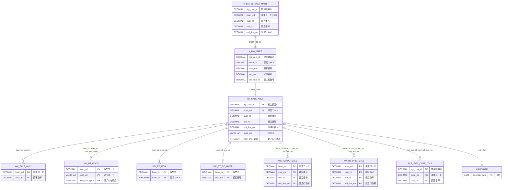

# BL販売分析マート ER図

## 概要

このドキュメントは、BL販売分析マート（V_BIA_BL_SALE_MART）と関連テーブルとの関係を示すER図です。

## ビュー階層構造

V_BIA_BL_SALE_MARTを最上位として、以下の階層構造になっています。

1. **V_BIA_BL_SALE_MART**（最上位ビュー）- V_BIA_MARTをBUSN_CD=10（総合通販）でフィルタリング
2. **V_BIA_MART**（分析ビュー）- RT_SALE_ANLYをベーステーブルとしてマスタ結合したビュー
3. **RT_SALE_ANLY**（ベーステーブル／販売分析マート）- 各ワークテーブルと結合

---

## 図1: 全体ハイレベル構造

ビュー階層とRT_SALE_ANLYから各カテゴリのワークテーブルへの関係を示します。

---

## 図2: 販売分析系ワークテーブルとTier2ソース

WK_SALE_ANLY系テーブルとその元となるTier2テーブルの関係を示します。

```mermaid
erDiagram
    %% ベーステーブル
    RT_SALE_ANLY {
        DECIMAL itgt_cust_id PK "統合顧客ID"
        DECIMAL busn_cd PK "事業コード"
        DECIMAL cust_no "顧客番号"
        DECIMAL ord_no "受注番号"
        DECIMAL ord_line_no "受注行番号"
    }

    %% 販売分析系ワークテーブル（Tier3）
    WK_SALE_ANLY {
        DECIMAL busn_cd PK "事業コード"
        DECIMAL cust_no PK "顧客番号"
        DECIMAL ord_no "受注番号"
        DECIMAL ord_line_no "受注行番号"
        VARCHAR exec_cd "実行コード"
        INTEGER new_prm_gods "新プロモ商品"
        DATE ordr_day "受注日"
    }

    WK_SALE_ANLY_BB {
        DECIMAL busn_cd PK "事業コード"
        DECIMAL cust_no PK "顧客番号"
        DECIMAL ord_no "受注番号"
        DECIMAL ord_line_no "受注行番号"
    }

    WK_SALE_ANLY_OB {
        DECIMAL busn_cd PK "事業コード"
        DECIMAL cust_no PK "顧客番号"
        DECIMAL ord_no "受注番号"
        DECIMAL ord_line_no "受注行番号"
    }

    WK_SALE_ANLY_GB {
        DECIMAL busn_cd PK "事業コード"
        DECIMAL cust_no PK "顧客番号"
        DECIMAL ord_no "受注番号"
        DECIMAL ord_line_no "受注行番号"
    }

    %% Tier2 販売分析系ソース
    V_COR_ORDR_HDR {
        DECIMAL busn_cd PK "事業コード"
        DECIMAL cust_no PK "顧客番号"
        DECIMAL ord_no PK "受注番号"
    }

    V_COR_ORDR_DTLS {
        DECIMAL busn_cd PK "事業コード"
        DECIMAL cust_no PK "顧客番号"
        DECIMAL ord_no PK "受注番号"
        DECIMAL ord_line_no PK "受注行番号"
    }

    V_COR_REQ_HDR {
        DECIMAL busn_cd PK "事業コード"
        DECIMAL cust_no PK "顧客番号"
        DECIMAL ord_no PK "受注番号"
    }

    V_COR_REQ_DTLS {
        DECIMAL busn_cd PK "事業コード"
        DECIMAL cust_no PK "顧客番号"
        DECIMAL ord_no PK "受注番号"
        DECIMAL ord_line_no PK "受注行番号"
    }

    V_COR_CUST_DEPO_HIST {
        DECIMAL busn_cd PK "事業コード"
        DECIMAL cust_no PK "顧客番号"
    }

    %% RT_SALE_ANLYからワークテーブルへ
    RT_SALE_ANLY ||--o{ WK_SALE_ANLY : "busn_cd, cust_no"
    RT_SALE_ANLY ||--o{ WK_SALE_ANLY_BB : "busn_cd, cust_no"
    RT_SALE_ANLY ||--o{ WK_SALE_ANLY_OB : "busn_cd, cust_no"
    RT_SALE_ANLY ||--o{ WK_SALE_ANLY_GB : "busn_cd, cust_no"

    %% Tier2からWK_SALE_ANLYへ
    V_COR_ORDR_HDR ||--o{ WK_SALE_ANLY : "busn_cd, cust_no, ord_no"
    V_COR_ORDR_DTLS ||--o{ WK_SALE_ANLY : "busn_cd, cust_no, ord_no, ord_line_no"
    V_COR_REQ_HDR ||--o{ WK_SALE_ANLY : "busn_cd, cust_no, ord_no"
    V_COR_REQ_DTLS ||--o{ WK_SALE_ANLY : "busn_cd, cust_no, ord_no, ord_line_no"
    V_COR_CUST_DEPO_HIST ||--o{ WK_SALE_ANLY : "busn_cd, cust_no"
```

---

## 図3: マスタ系ワークテーブル（商品）とTier2ソース

WK_RT_GODS（商品マスタワーク）とその元となるTier2テーブルの関係を示します。
**生成ジョブ**: MRT_WK_GDS_100.sql

※ER図には代表的なTier2テーブルを表示しています。全INPUTテーブルは下記の「WK_RT_GODS（商品マスタワーク）の元テーブル」表を参照してください。

```mermaid
erDiagram
    %% ベーステーブル
    RT_SALE_ANLY {
        DECIMAL itgt_cust_id PK "統合顧客ID"
        DECIMAL busn_cd PK "事業コード"
        VARCHAR exec_cd "実行コード"
        INTEGER new_prm_gods "新プロモ商品"
    }

    %% マスタ系ワークテーブル（Tier3）
    WK_RT_GODS {
        DECIMAL busn_cd PK "事業コード"
        VARCHAR exec_cd PK "実行コード"
        INTEGER new_prm_gods PK "新プロモ商品"
        VARCHAR gods_cd "商品コード"
        VARCHAR prm_gods "プロモ商品"
        DECIMAL gods_lrge_class_cd "商品大分類"
        DECIMAL gods_mid_class_cd "商品中分類"
    }

    %% Tier2 商品マスタ系ソース（代表）
    V_COR_EXCD_GODS {
        DECIMAL busn_cd PK "事業コード"
        VARCHAR exec_cd PK "実行コード"
        INTEGER new_prm_gods "新プロモ商品"
    }

    V_COR_PRM_GODS_S1_BBOB {
        DECIMAL busn_cd PK "事業コード"
        VARCHAR prm_cd PK "プロモーションコード"
        INTEGER new_prm_gods "新プロモ商品"
        VARCHAR gods_cd "商品コード"
    }

    V_COR_PRM_GODS {
        DECIMAL busn_cd PK "事業コード"
        VARCHAR prm_cd PK "プロモーションコード"
        INTEGER new_prm_gods "新プロモ商品"
        VARCHAR prm_gods "プロモ商品"
    }

    V_COR_GODS {
        DECIMAL busn_cd PK "事業コード"
        VARCHAR gods_cd PK "商品コード"
        DECIMAL gods_srno PK "商品連番"
        VARCHAR gods_nm "商品名"
    }

    V_COR_GODS_ANLY {
        DECIMAL busn_cd PK "事業コード"
        VARCHAR gods_cd PK "商品コード"
        DECIMAL gods_srno PK "商品連番"
        DECIMAL anly_prpy_id "分析属性ID"
        DECIMAL anly_prpy_cd "分析属性コード"
    }

    V_COR_GODS_S1_BBOB {
        DECIMAL busn_cd PK "事業コード"
        VARCHAR gods_cd PK "商品コード"
        DECIMAL gods_srno PK "商品連番"
    }

    V_COR_GODS_S2_BB {
        DECIMAL busn_cd PK "事業コード"
        VARCHAR gods_cd PK "商品コード"
        DECIMAL gods_srno PK "商品連番"
    }

    V_COR_OL_GODS_DTLS {
        DECIMAL busn_cd PK "事業コード"
        INTEGER new_prm_gods "新プロモ商品"
        VARCHAR cata_no "カタログ番号"
        VARCHAR ec_gods_no "EC商品番号"
    }

    V_COR_OL_GODS {
        DECIMAL busn_cd PK "事業コード"
        VARCHAR cata_no PK "カタログ番号"
        VARCHAR ec_gods_no PK "EC商品番号"
    }

    RT_APRL_SIZE {
        VARCHAR size_cd PK "サイズコード"
        VARCHAR chng_size "変換サイズ"
    }

    %% RT_SALE_ANLYからワークテーブルへ
    RT_SALE_ANLY ||--o{ WK_RT_GODS : "busn_cd, exec_cd, new_prm_gods"

    %% Tier2からWK_RT_GODSへ
    V_COR_EXCD_GODS ||--o{ WK_RT_GODS : "busn_cd, exec_cd, new_prm_gods"
    V_COR_PRM_GODS_S1_BBOB ||--o{ WK_RT_GODS : "busn_cd, new_prm_gods"
    V_COR_PRM_GODS ||--o{ WK_RT_GODS : "busn_cd, prm_cd, new_prm_gods"
    V_COR_GODS ||--o{ WK_RT_GODS : "busn_cd, gods_cd, gods_srno"
    V_COR_GODS_ANLY ||--o{ WK_RT_GODS : "busn_cd, gods_cd, gods_srno"
    V_COR_GODS_S1_BBOB ||--o{ WK_RT_GODS : "busn_cd, gods_cd, gods_srno"
    V_COR_GODS_S2_BB ||--o{ WK_RT_GODS : "busn_cd, gods_cd, gods_srno"
    V_COR_OL_GODS_DTLS ||--o{ WK_RT_GODS : "busn_cd, new_prm_gods"
    V_COR_OL_GODS ||--o{ WK_RT_GODS : "busn_cd, cata_no, ec_gods_no"
    RT_APRL_SIZE ||--o{ WK_RT_GODS : "size_cd"
```

---

## 図4: マスタ系ワークテーブル（媒体・EC）とTier2ソース

WK_RT_MDIA（媒体マスタワーク）とWK_RT_EC_MMBR（EC会員ワーク）、およびその元となるTier2テーブルの関係を示します。

**WK_RT_MDIA 生成ジョブ**: MRT_WK_MDIA_100.sql
**WK_RT_EC_MMBR 生成ジョブ**: MRT_WK_EC_100.sql

※WK_RT_EC_MMBRは、メールマガジンID付与のためにWK_RT_MLMG_ENTR（Tier3ワークテーブル）も参照していますが、Tier2ソース図には含めていません。

---

## 図5: 詳細系ワークテーブルとTier2ソース

WK_HANPU_DTLS（頒布会詳細ワーク）とWK_RT_PRID_DTLS（定期詳細ワーク）、およびその元となるTier2テーブルの関係を示します。

---

## 図6: 顧客系・カレンダー・在庫テーブル

ACS_ITGT_CUST_DTLS（統合顧客詳細）、CALENDAR（カレンダー）、V_COR_MM_STK（在庫）との関係を示します。

---

## テーブル間のリレーションシップ詳細

### ビュー階層

| 関連元 | 関連先 | 結合条件 | 説明 |
|--------|--------|----------|------|
| V_BIA_BL_SALE_MART | V_BIA_MART | BUSN_CD=10 | 総合通販用フィルタ |
| V_BIA_MART | RT_SALE_ANLY | - | RT_SALE_ANLYがベーステーブル |

### 販売分析ワークテーブル

| 関連元 | 関連先 | 結合キー | カーディナリティ |
|--------|--------|----------|------------------|
| RT_SALE_ANLY | WK_SALE_ANLY | busn_cd, cust_no | 1:N |
| RT_SALE_ANLY | WK_SALE_ANLY_BB | busn_cd, cust_no | 1:N |
| RT_SALE_ANLY | WK_SALE_ANLY_OB | busn_cd, cust_no | 1:N |
| RT_SALE_ANLY | WK_SALE_ANLY_GB | busn_cd, cust_no | 1:N |

### 販売分析系ワークテーブルのTier2元テーブル

#### WK_SALE_ANLY（販売分析ワーク）の元テーブル

| Tier2テーブル | 結合キー | 説明 |
|---------------|----------|------|
| V_COR_ORDR_HDR | busn_cd, cust_no, ord_no | 受注ヘッダ |
| V_COR_ORDR_DTLS | busn_cd, cust_no, ord_no, ord_line_no | 受注明細 |
| V_COR_REQ_HDR | busn_cd, cust_no, ord_no | 依頼ヘッダ |
| V_COR_REQ_DTLS | busn_cd, cust_no, ord_no, ord_line_no | 依頼明細 |
| V_COR_CUST_DEPO_HIST | busn_cd, cust_no | 顧客入金履歴 |

### マスタ系ワークテーブル

| 関連元 | 関連先 | 結合キー | カーディナリティ |
|--------|--------|----------|------------------|
| RT_SALE_ANLY | WK_RT_GODS | busn_cd, exec_cd, new_prm_gods | 1:N |
| RT_SALE_ANLY | WK_RT_MDIA | busn_cd, exec_cd | 1:N |

### マスタ系ワークテーブルのTier2元テーブル

#### WK_RT_GODS（商品マスタワーク）の元テーブル

**生成ジョブ**: MRT_WK_GDS_100.sql

| Tier2テーブル | 結合キー | 説明 |
|---------------|----------|------|
| V_COR_PRM_GODS_S1_BBOB | busn_cd, prm_cd, new_prm_gods | プロモ商品_総合通販・オージオ用 |
| V_COR_PRM_GODS_S1_GB | busn_cd, prm_cd, new_prm_gods | プロモ商品_グルメ用 |
| V_COR_PRM_GODS | busn_cd, prm_cd, new_prm_gods | プロモ商品 |
| V_COR_HANPU_GODS | busn_cd, hanpukai_cd | 頒布商品 |
| V_COR_EXCD_GODS | busn_cd, exec_cd, new_prm_gods | 実行コード商品 |
| V_COR_GODS | busn_cd, gods_cd, gods_srno | 商品マスタ |
| V_COR_GODS_ANLY | busn_cd, gods_cd, gods_srno | 商品分析 |
| V_COR_GODS_S2_BB | busn_cd, gods_cd, gods_srno | 商品_総合通販用 |
| V_COR_GODS_S1_BBOB | busn_cd, gods_cd, gods_srno | 商品_総合通販・オージオ用 |
| V_COR_GODS_S2_OB | busn_cd, gods_cd, gods_srno | 商品_オージオ用 |
| V_COR_OL_GODS_DTLS | busn_cd, new_prm_gods | オンライン商品詳細 |
| V_COR_OL_GODS | busn_cd, cata_no, ec_gods_no | オンライン商品 |
| V_COR_GODS_S1_GB | busn_cd, gods_cd, gods_srno | 商品_グルメ用 |
| RT_APRL_SIZE | size_cd | アパレルサイズ |
| RT_GODS_GENR_GODS_FLD | gods_genr_cd | 商品ジャンルマスタ |

#### WK_RT_MDIA（媒体マスタワーク）の元テーブル

**生成ジョブ**: MRT_WK_MDIA_100.sql

| Tier2テーブル | 結合キー | 説明 |
|---------------|----------|------|
| V_COR_MDIA | busn_cd, mdia_cd | 媒体マスタ |
| V_COR_PRM | busn_cd, prm_cd | プロモーションマスタ |
| V_COR_EXCD | busn_cd, exec_cd | 実行コードマスタ |
| V_COR_PRM_S1_BBOB | busn_cd, prm_cd | プロモーション_総合通販・オージオ用 |
| V_COR_PRM_S1_GB | busn_cd, prm_cd | プロモーション_グルメ用 |
| V_COR_MDIA_S1_BBOB | busn_cd, mdia_cd | 媒体_総合通販・オージオ用 |

### EC系ワークテーブル

| 関連元 | 関連先 | 結合キー | カーディナリティ |
|--------|--------|----------|------------------|
| RT_SALE_ANLY | WK_RT_EC_MMBR | busn_cd, cust_no | 1:N |

### EC系ワークテーブルのTier2元テーブル

#### WK_RT_EC_MMBR（EC会員ワーク）の元テーブル

**生成ジョブ**: MRT_WK_EC_100.sql

| Tier2テーブル | 結合キー | 説明 |
|---------------|----------|------|
| V_COR_CUST_WEB_PRPY | busn_cd, cust_no | 顧客Web属性 |
| V_COR_MMBR_EC | busn_cd, web_mmbr_no | EC会員マスタ |

※メールマガジンID（mail_mgzn_id）は、WK_RT_MLMG_ENTR（Tier3ワークテーブル）経由で付与されます。

### 詳細系ワークテーブル

| 関連元 | 関連先 | 結合キー | カーディナリティ |
|--------|--------|----------|------------------|
| RT_SALE_ANLY | WK_HANPU_DTLS | busn_cd, cust_no, ord_no, ord_line_no | 1:N |
| RT_SALE_ANLY | WK_RT_PRID_DTLS | busn_cd, cust_no, ord_no, ord_line_no | 1:N |

### 詳細系ワークテーブルのTier2元テーブル

#### WK_HANPU_DTLS（頒布会詳細ワーク）の元テーブル

| Tier2テーブル | 結合キー | 説明 |
|---------------|----------|------|
| V_COR_ORDR_DTLS_S1_GB | busn_cd, cust_no, ord_no, ord_line_no | 受注明細（頒布会用） |
| V_COR_ORDR_HDR_S1_GB | busn_cd, cust_no, ord_no | 受注ヘッダ（頒布会用） |
| V_COR_ORDR_DTLS | busn_cd, cust_no, ord_no, ord_line_no | 受注明細 |
| V_COR_REQ_HDR | busn_cd, cust_no, ord_no | 依頼ヘッダ |

#### WK_RT_PRID_DTLS（定期詳細ワーク）の元テーブル

| Tier2テーブル | 結合キー | 説明 |
|---------------|----------|------|
| V_COR_PRID_ORDR_INFO | busn_cd, cust_no, prid_ordr_no | 定期受注情報 |
| V_COR_ORDR_DTLS_S2_OB | busn_cd, cust_no, ord_no, ord_line_no | 受注明細（定期用） |
| V_COR_ORDR_HDR_S2_OB | busn_cd, cust_no, ord_no | 受注ヘッダ（定期用） |
| V_COR_ORDR_DTLS | busn_cd, cust_no, ord_no, ord_line_no | 受注明細 |

### 顧客系・カレンダー

| 関連元 | 関連先 | 結合キー | カーディナリティ |
|--------|--------|----------|------------------|
| RT_SALE_ANLY | ACS_ITGT_CUST_DTLS | itgt_cust_id, busn_cd, cust_no | 1:N |
| RT_SALE_ANLY | CALENDAR | ordr_day | N:1 |

### Tier2マスタビュー（RT_SALE_ANLYに直接結合）

| 関連元 | 関連先 | 結合キー | カーディナリティ |
|--------|--------|----------|------------------|
| RT_SALE_ANLY | V_COR_PRM_GODS | busn_cd, new_prm_gods | N:1 |
| RT_SALE_ANLY | V_COR_MM_STK | busn_cd, gods_cd, gods_srno, yymm | N:1 |

---

## 主要キー項目一覧

### RT_SALE_ANLY / WK_SALE_ANLY 共通キー
- busn_cd（事業コード）
- cust_no（顧客番号）
- ord_no（受注番号）
- ord_line_no（受注行番号）

### WK_RT_GODS 主キー
- busn_cd（事業コード）
- exec_cd（実行コード）
- new_prm_gods（新プロモ商品）

### WK_RT_MDIA 主キー
- busn_cd（事業コード）
- exec_cd（実行コード）

### WK_RT_EC_MMBR 主キー
- busn_cd（事業コード）
- cust_no（顧客番号）

### WK_HANPU_DTLS / WK_RT_PRID_DTLS 主キー
- busn_cd（事業コード）
- cust_no（顧客番号）
- ord_no（受注番号）
- ord_line_no（受注行番号）

---

## 参照元ファイル

- data_lineage/01_twrview/V_BIA_MART.sql
- data_lineage/01_twrview/V_BIA_BL_SALE_MART.sql
- data_lineage/02_DWH_ACS/RT_SALE_ANLY.ct
- data_lineage/02_DWH_ACS/WK_SALE_ANLY.ct
- data_lineage/02_DWH_ACS/WK_SALE_ANLY_BB.ct
- data_lineage/02_DWH_ACS/WK_SALE_ANLY_OB.ct
- data_lineage/02_DWH_ACS/WK_SALE_ANLY_GB.ct
- data_lineage/02_DWH_ACS/WK_RT_GODS.ct
- data_lineage/02_DWH_ACS/WK_RT_MDIA.ct
- data_lineage/02_DWH_ACS/WK_RT_EC_MMBR.ct
- data_lineage/02_DWH_ACS/WK_HANPU_DTLS.ct
- data_lineage/02_DWH_ACS/WK_RT_PRID_DTLS.ct
- data_lineage/02_DWH_ACS/ACS_ITGT_CUST_DTLS.ct
- data_lineage/02_DWH_ACS/CALENDAR.ct
- 11_分析マート/MRT/MRT_WK_SALE_400.sql
- 11_分析マート/MRT/MRT_WK_GDS_100.sql
- 11_分析マート/MRT/MRT_WK_MDIA_100.sql
- 11_分析マート/MRT/MRT_WK_EC_100.sql
- 11_分析マート/MRT/MRT_WK_HNP_100.sql
- 11_分析マート/MRT/MRT_WK_PRID_100.sql
