# BL販売分析マート ER図（マスタ系ワークテーブル）

## 概要

このドキュメントは、BL販売分析マート（V_BIA_BL_SALE_MART）のマスタ系ワークテーブル（商品・媒体・EC）とその元となるTier2テーブルとの関係を示すER図です。

## ビュー階層構造

V_BIA_BL_SALE_MARTを最上位として、以下の階層構造になっています。

1. **V_BIA_BL_SALE_MART**（最上位ビュー）- V_BIA_MARTをBUSN_CD=10（総合通販）でフィルタリング
2. **V_BIA_MART**（分析ビュー）- RT_SALE_ANLYをベーステーブルとしてマスタ結合したビュー
3. **RT_SALE_ANLY**（ベーステーブル／販売分析マート）- 各ワークテーブルと結合

---

## ER図（マスタ系ワークテーブル：商品・媒体・EC）

```mermaid
erDiagram
    %% ========================================
    %% 最上位ビュー
    %% ========================================
    V_BIA_BL_SALE_MART {
        DECIMAL itgt_cust_id "統合顧客ID"
        DECIMAL busn_cd "事業コード(=10)"
        DECIMAL cust_no "顧客番号"
        DECIMAL ord_no "受注番号"
        DECIMAL ord_line_no "受注行番号"
    }

    %% ========================================
    %% 分析ビュー
    %% ========================================
    V_BIA_MART {
        DECIMAL itgt_cust_id "統合顧客ID"
        DECIMAL busn_cd "事業コード"
        DECIMAL cust_no "顧客番号"
        DECIMAL ord_no "受注番号"
        DECIMAL ord_line_no "受注行番号"
        VARCHAR exec_cd "実行コード"
        INTEGER new_prm_gods "新プロモ商品"
    }

    %% ========================================
    %% ベーステーブル（販売分析マート）
    %% ========================================
    RT_SALE_ANLY {
        DECIMAL itgt_cust_id PK "統合顧客ID"
        DECIMAL busn_cd PK "事業コード"
        DECIMAL cust_no "顧客番号"
        DECIMAL ord_no "受注番号"
        DECIMAL ord_line_no "受注行番号"
        VARCHAR exec_cd "実行コード"
        INTEGER new_prm_gods "新プロモ商品"
    }

    %% ========================================
    %% マスタ系ワークテーブル（Tier3）- 商品
    %% ========================================
    WK_RT_GODS {
        DECIMAL busn_cd PK "事業コード"
        VARCHAR exec_cd PK "実行コード"
        INTEGER new_prm_gods PK "新プロモ商品"
        VARCHAR gods_cd "商品コード"
        VARCHAR prm_gods "プロモ商品"
        DECIMAL gods_lrge_class_cd "商品大分類"
        DECIMAL gods_mid_class_cd "商品中分類"
    }

    %% ========================================
    %% マスタ系ワークテーブル（Tier3）- 媒体
    %% ========================================
    WK_RT_MDIA {
        DECIMAL busn_cd PK "事業コード"
        VARCHAR exec_cd PK "実行コード"
        VARCHAR mdia_cd "媒体コード"
        VARCHAR mdia_nm_kanji "媒体名"
        VARCHAR prm_cd "プロモーションコード"
        VARCHAR prm_name "プロモーション名"
    }

    %% ========================================
    %% EC系ワークテーブル（Tier3）
    %% ========================================
    WK_RT_EC_MMBR {
        DECIMAL busn_cd PK "事業コード"
        DECIMAL cust_no PK "顧客番号"
        VARCHAR ec_mmbr_no "EC会員番号"
        VARCHAR web_mmbr_no "Web会員番号"
        DECIMAL ec_del_flg "EC退会フラグ"
        VARCHAR pc_mail_adrs "PCメールアドレス"
        VARCHAR name_kanji "氏名漢字"
    }

    %% ========================================
    %% Tier2 商品マスタ系ソース（WK_RT_GODSの元テーブル）
    %% ========================================
    V_COR_GODS {
        DECIMAL busn_cd PK "事業コード"
        VARCHAR gods_cd PK "商品コード"
        VARCHAR gods_nm "商品名"
    }

    V_COR_GODS_ANLY {
        DECIMAL busn_cd PK "事業コード"
        VARCHAR gods_cd PK "商品コード"
        DECIMAL gods_lrge_class_cd "商品大分類"
        DECIMAL gods_mid_class_cd "商品中分類"
    }

    V_COR_EXCD_GODS {
        DECIMAL busn_cd PK "事業コード"
        VARCHAR exec_cd PK "実行コード"
        VARCHAR gods_cd "商品コード"
    }

    V_COR_HANPU_GODS {
        DECIMAL busn_cd PK "事業コード"
        VARCHAR hanpukai_cd PK "頒布会コード"
        VARCHAR gods_cd "商品コード"
    }

    V_COR_OL_GODS {
        DECIMAL busn_cd PK "事業コード"
        VARCHAR gods_cd PK "商品コード"
        VARCHAR ol_gods_nm "オンライン商品名"
    }

    V_COR_PRM_GODS {
        DECIMAL busn_cd PK "事業コード"
        INTEGER new_prm_gods PK "新プロモ商品"
        VARCHAR prm_gods_name "プロモ商品名"
    }

    %% ========================================
    %% Tier2 媒体マスタ系ソース（WK_RT_MDIAの元テーブル）
    %% ========================================
    V_COR_MDIA {
        DECIMAL busn_cd PK "事業コード"
        VARCHAR mdia_cd PK "媒体コード"
        VARCHAR mdia_nm_kanji "媒体名"
    }

    V_COR_PRM {
        DECIMAL busn_cd PK "事業コード"
        VARCHAR prm_cd PK "プロモーションコード"
        VARCHAR prm_name "プロモーション名"
    }

    V_COR_EXCD {
        DECIMAL busn_cd PK "事業コード"
        VARCHAR exec_cd PK "実行コード"
        VARCHAR exec_nm "実行コード名"
    }

    %% ========================================
    %% Tier2 EC系ソース（WK_RT_EC_MMBRの元テーブル）
    %% ========================================
    V_COR_MMBR_EC {
        DECIMAL busn_cd PK "事業コード"
        VARCHAR ec_mmbr_no PK "EC会員番号"
        VARCHAR web_mmbr_no "Web会員番号"
        DECIMAL del_flg "削除フラグ"
        VARCHAR pc_mail_adrs "PCメールアドレス"
        VARCHAR name_kanji "氏名漢字"
    }

    V_COR_CUST_WEB_PRPY {
        DECIMAL busn_cd PK "事業コード"
        DECIMAL cust_no PK "顧客番号"
        VARCHAR web_mmbr_no "Web会員番号"
        DECIMAL del_flg "削除フラグ"
    }

    %% ========================================
    %% リレーションシップ
    %% ========================================
    
    %% 最上位ビュー（V_BIA_BL_SALE_MART）からの階層構造
    V_BIA_BL_SALE_MART ||--|| V_BIA_MART : "BUSN_CD=10 filter"

    %% 分析ビューからベーステーブルへの関係
    V_BIA_MART ||--|| RT_SALE_ANLY : "base_table"

    %% RT_SALE_ANLYからマスタ系ワークテーブルへの関係
    RT_SALE_ANLY ||--o{ WK_RT_GODS : "busn_cd, exec_cd, new_prm_gods"
    RT_SALE_ANLY ||--o{ WK_RT_MDIA : "busn_cd, exec_cd"
    RT_SALE_ANLY ||--o{ WK_RT_EC_MMBR : "busn_cd, cust_no"

    %% ========================================
    %% Tier2 → WK_RT_GODS（商品マスタワーク）の関係
    %% ========================================
    V_COR_GODS ||--o{ WK_RT_GODS : "busn_cd, gods_cd"
    V_COR_GODS_ANLY ||--o{ WK_RT_GODS : "busn_cd, gods_cd"
    V_COR_EXCD_GODS ||--o{ WK_RT_GODS : "busn_cd, exec_cd"
    V_COR_HANPU_GODS ||--o{ WK_RT_GODS : "busn_cd, hanpukai_cd"
    V_COR_OL_GODS ||--o{ WK_RT_GODS : "busn_cd, gods_cd"
    V_COR_PRM_GODS ||--o{ WK_RT_GODS : "busn_cd, new_prm_gods"

    %% ========================================
    %% Tier2 → WK_RT_MDIA（媒体マスタワーク）の関係
    %% ========================================
    V_COR_MDIA ||--o{ WK_RT_MDIA : "busn_cd, mdia_cd"
    V_COR_PRM ||--o{ WK_RT_MDIA : "busn_cd, prm_cd"
    V_COR_EXCD ||--o{ WK_RT_MDIA : "busn_cd, exec_cd"

    %% ========================================
    %% Tier2 → WK_RT_EC_MMBR（EC会員ワーク）の関係
    %% ========================================
    V_COR_MMBR_EC ||--o{ WK_RT_EC_MMBR : "busn_cd, web_mmbr_no"
    V_COR_CUST_WEB_PRPY ||--o{ WK_RT_EC_MMBR : "busn_cd, cust_no"
```

---

## テーブル間のリレーションシップ詳細

### ビュー階層

| 関連元 | 関連先 | 結合条件 | 説明 |
|--------|--------|----------|------|
| V_BIA_BL_SALE_MART | V_BIA_MART | BUSN_CD=10 | 総合通販用フィルタ |
| V_BIA_MART | RT_SALE_ANLY | - | RT_SALE_ANLYがベーステーブル |

### マスタ系ワークテーブル

| 関連元 | 関連先 | 結合キー | カーディナリティ |
|--------|--------|----------|------------------|
| RT_SALE_ANLY | WK_RT_GODS | busn_cd, exec_cd, new_prm_gods | 1:N |
| RT_SALE_ANLY | WK_RT_MDIA | busn_cd, exec_cd | 1:N |
| RT_SALE_ANLY | WK_RT_EC_MMBR | busn_cd, cust_no | 1:N |

### WK_RT_GODS（商品マスタワーク）のTier2元テーブル

| Tier2テーブル | 結合キー | 説明 |
|---------------|----------|------|
| V_COR_GODS | busn_cd, gods_cd | 商品マスタ |
| V_COR_GODS_ANLY | busn_cd, gods_cd | 商品分析 |
| V_COR_EXCD_GODS | busn_cd, exec_cd | 実行コード商品 |
| V_COR_HANPU_GODS | busn_cd, hanpukai_cd | 頒布商品 |
| V_COR_OL_GODS | busn_cd, gods_cd | オンライン商品 |
| V_COR_PRM_GODS | busn_cd, new_prm_gods | プロモ商品 |

### WK_RT_MDIA（媒体マスタワーク）のTier2元テーブル

| Tier2テーブル | 結合キー | 説明 |
|---------------|----------|------|
| V_COR_MDIA | busn_cd, mdia_cd | 媒体マスタ |
| V_COR_PRM | busn_cd, prm_cd | プロモーションマスタ |
| V_COR_EXCD | busn_cd, exec_cd | 実行コードマスタ |

### WK_RT_EC_MMBR（EC会員ワーク）のTier2元テーブル

| Tier2テーブル | 結合キー | 説明 |
|---------------|----------|------|
| V_COR_MMBR_EC | busn_cd, web_mmbr_no | EC会員マスタ |
| V_COR_CUST_WEB_PRPY | busn_cd, cust_no | 顧客Web属性 |

---

## 主要キー項目一覧

### WK_RT_GODS 主キー
- busn_cd（事業コード）
- exec_cd（実行コード）
- new_prm_gods（新プロモ商品）

### WK_RT_MDIA 主キー
- busn_cd（事業コード）
- exec_cd（実行コード）

### WK_RT_EC_MMBR 主キー
- busn_cd（事業コード）
- cust_no（顧客番号）

---

## 参照元ファイル

- data_lineage/01_twrview/V_BIA_MART.sql
- data_lineage/01_twrview/V_BIA_BL_SALE_MART.sql
- data_lineage/02_DWH_ACS/RT_SALE_ANLY.ct
- data_lineage/02_DWH_ACS/WK_RT_GODS.ct
- data_lineage/02_DWH_ACS/WK_RT_MDIA.ct
- data_lineage/02_DWH_ACS/WK_RT_EC_MMBR.ct
- 11_分析マート/MRT/MRT_WK_GDS_100.sql
- 11_分析マート/MRT/MRT_WK_MDIA_100.sql
- 11_分析マート/MRT/MRT_WK_EC_100.sql
